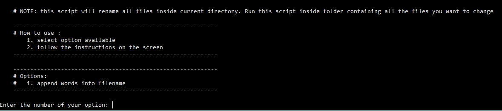

# 

This is file renamer script to rename all of the files contained inside folder.

# How to use 

1. Change Run
2. Run this script through terminal : 
		
		python3 main.py	
3. Select options available 
4. Follow the instructions displayed afterwards
		